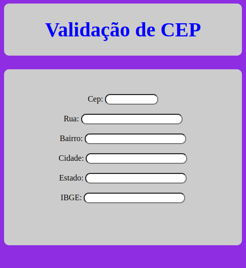

# Consulte CEPs de todo o Brasil via API do Via cep
<p align="center">
  
</p>

## 🎯 Sobre

Esse é uma aplicação baseada em JavaScript, que contém uma página onde o usuário informe o CEP em um campo texto com a máscara apropriada.

## ✨ Funcionalidades

A aplicação valida, consulta a API Viacep e preenche na tela os campos Cidade, Estado e Logradouro, sendo que estes 3 últimos campos estão desabilitados para edição. 

Após a inserção do cep para consulta, deve-se apertar a tecla TAB para ocorrer a busca na API.

## 🚀 Tecnologias

HTML5, Java SCript e CSS3

## 🏁 clone o repositório e entre na pasta do projeto.

```bash
# Clone este repositório
$ git clone https://github.com/DiegoBolonik/logikee.git
# Entre na pasta
$ cd logikee
# Abre o arquivo no navegador: index.html
```
